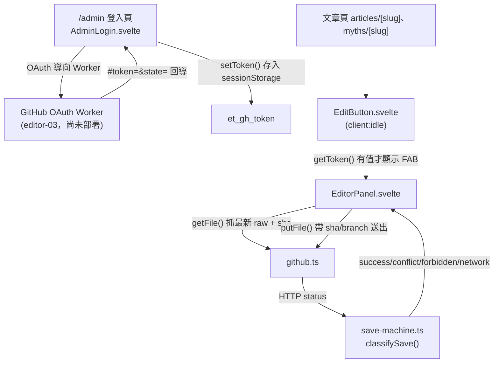

# Playbook：前台 MDX 編輯器 spine 核心

## 何時看這份

任務涉及以下任一情況：

- 修改 `/admin` 登入頁、`src/components/editor/AdminLogin.svelte`、新增文章 `NewArticle.svelte`
- 改編輯按鈕 `EditButton.svelte`、編輯面板 `EditorPanel.svelte`、SEO 欄位表單 `SeoFields.svelte`
- 改 SEO 欄位描述子 `src/utils/editor/seo-schema.ts`
- 改 GitHub commit client（`src/utils/editor/github.ts`）、存檔狀態機（`save-machine.ts`）、token 工具（`token.ts`）
- 把「編輯」按鈕掛到新的內容類型頁（articles / myths 之外）
- 調整 OAuth Worker 回導契約（`/admin#token=&state=`）

> 此編輯器是「裝飾層」：真正的寫入安全在 GitHub 端驗證（token 的 repo 寫入權）。前台的 `state` 僅作 CSRF 對照，非密鑰。

## 架構總覽

## 進入點

| 進入點 | 檔案 | 說明 |
|---|---|---|
| `/admin` | `src/pages/admin.astro` + `AdminLogin.svelte` | 隱藏管理登入頁。`noindex`，且已從 sitemap 排除（見下）。`client:only="svelte"`，因為元件讀 `sessionStorage`/`location`。 |
| 編輯按鈕 | `src/components/editor/EditButton.svelte` | `client:idle` island，`onMount` 偵測 `getToken()` 有值才顯示右下角 FAB。掛在 articles / myths 的 `[slug].astro`，於 `</Article>` 之前。 |
| 編輯面板 | `src/components/editor/EditorPanel.svelte` | 點 FAB 後開啟。**事實來源為 `{frontmatter, body}` 模型**（非 raw 字串）。載入時 `parse` 並記下 sha，存檔前 `serialize` 做 frontmatter 護欄。雙分頁見下節。 |
| SEO 欄位 | `src/components/editor/SeoFields.svelte` | 由 `getSeoFields(collection)` 的 `SeoFieldDescriptor[]` 驅動的 SEO/AEO 表單，含字數提示（description≤160、ogTitle≤60 等）。emit `onchange(newFrontmatter)` 回寫 EditorPanel 的 `frontmatter`。 |
| 新增文章 | `src/components/editor/NewArticle.svelte` | 掛在 `/admin`。選 collection + 輸入 slug（驗證 `^[a-z0-9-]+$`）→ 建一個 `sha=null` 的 `initialDoc` → 開 EditorPanel 進入新增模式。`client:only="svelte"`。 |

## token 流程

1. `/admin` → 按「用 GitHub 登入」→ 產生 `state`（`Math.random`，僅 CSRF 對照）存進 `sessionStorage.et_oauth_state` → 導向 Worker `/auth?state=`。
2. Worker 完成 OAuth 後回導 `/admin#token=<gh_token>&state=<state>`。
3. `AdminLogin` 的 `onMount` 比對 fragment 的 `state` 與暫存的 `et_oauth_state`，相符才 `setToken()` 存入 `sessionStorage.et_gh_token`，並清掉 fragment。
4. 之後全站文章頁的 `EditButton` 偵測到 `et_gh_token` 即顯示「編輯」。
5. 登出 = `clearToken()` 移除 `et_gh_token`。

> token 存 `sessionStorage`（非 localStorage）：關閉分頁即失效，降低遺留風險。

## commit 流程（github.ts）

- `getFile(path, token)` → `GET /contents/<path>?ref=main`，回 `{ content (utf8 解碼), sha }`。
- `putFile({ path, content, sha, message, token })` → `PUT /contents/<path>`，body 帶 `branch: 'main'`、base64 編碼的 content，有 `sha` 才帶（更新既有檔）。回 HTTP status。
- base64 使用 UTF-8 安全的 `TextEncoder`/`btoa`、`atob`/`TextDecoder`，瀏覽器與 node 皆可（單元測試用 node）。

## 存檔狀態機（save-machine.ts）

`classifySave(status)` 四態，皆附可行動引導訊息：

| status | state | 引導 |
|---|---|---|
| 200 / 201 | `success` | 已存檔，部署中 |
| 409 | `conflict` | 提示按「重新載入最新版」重做，反覆衝突找網站工程師 |
| 403 | `forbidden` | 帳號無 repo 寫入權，確認管理者帳號或找工程師開通 |
| 其他 / fetch 失敗 | `network` | 連線異常，內容仍保留在頁面 |

## SEO 欄位 / 原始碼雙分頁（單一事實來源）

EditorPanel 持有 `frontmatter` + `body` 兩個 `$state`，**兩個分頁編輯的是同一個模型**，不會分歧：

- **「SEO 欄位」分頁**：渲染 `SeoFields`（綁 `frontmatter`）＋ 正文 `<textarea>`（`bind:value={body}`）。SeoFields 的 `onchange` 以不可變更新（`{ ...frontmatter, [key]: value }`）回寫 `frontmatter`。
- **「原始碼」分頁**：進入時 `enterSource()` 把當前模型 `serialize` 成 `rawDraft` 字串。三條離開路徑全部走共用的 `commitSourceDraft(): boolean`（唯一真相來源，`parse` 回 `frontmatter`/`body`，成功回 `true` 並清訊息、失敗回 `false` 並設錯誤訊息且不覆寫模型）：
  - 「套用原始碼」`applySource()`：commit 成功才切回 SEO 分頁。
  - 「SEO 欄位」分頁鈕 `goSeoTab()`：在原始碼分頁時先 commit，成功才切頁；失敗留在原始碼分頁顯示錯誤（不默默丟棄編輯）。
  - 「儲存」`save()`：若當前在原始碼分頁，先 `commitSourceDraft()`；解析失敗則 `status='error'` 並中止存檔（不 `putFile`、不推 GitHub）。
- 存檔一律在模型反映最新草稿後 `serialize({ frontmatter, body })` 再送 `putFile`，兩分頁殊途同歸。
- **不變式**：原始碼分頁的編輯不存在被默默丟棄的路徑——不是被套用進模型，就是以解析錯誤擋下並留在原始碼分頁。

> SEO 欄位由 `src/utils/editor/seo-schema.ts` 的 `getSeoFields(collection)` 驅動（per-collection 描述子；articles/myths/ingredients 目前共用 COMMON）。要加欄位或讓某 collection 不同，改 `BY_COLLECTION` 即可，UI 自動跟著長。

## 新增文章流程（sha=null 建檔）

1. `/admin` 登入後，`NewArticle` 顯示 collection 下拉 + slug 輸入。
2. 按「建立並編輯」→ slug 驗 `^[a-z0-9-]+$`（不符 `alert`）→ 組 `repoPath = src/content/<collection>/<slug>.mdx`、`initialDoc = { frontmatter: { title, description, publishDate }, body }`。
3. 以 `initialDoc` 開 EditorPanel。`initialDoc` 非空時面板進入新增模式：`sha=null`、跳過 `getFile`、`status='ready'`。
4. 存檔走 `putFile`（**不帶 sha → GitHub 建立新檔**），commit message 為 `content: 前台新增 <slug>`。
5. slug 撞既有檔：因新增模式無 sha，GitHub 回 422/409 → 由 `classifySave` 顯示衝突引導。

> 編輯既有文章與新增共用同一個 `EditorPanel`。差別只在有無 `initialDoc`：有則新增（sha=null），無則 `getFile` 載入既有（記 sha）。EditButton 不傳 `initialDoc`，行為與重構前一致。

## 鎖定參數（動之前必看）

- repo 常數寫死在 `github.ts`：`OWNER = 'weiqi-kids'`、`REPO = 'evidencetoday.news'`、`branch: 'main'`。換 repo 要改這裡。
- `WORKER` 網域在 `AdminLogin.svelte` 是 placeholder（`<account>`），Worker 部署後填實際值。**不影響 build 編譯**。
- `/admin` 排除 sitemap：在 `astro.config.mjs` 用 `sitemap({ filter: (page) => !page.includes('/admin') })`。新增其他隱藏頁要一併加進 filter。
- 掛 EditButton 的 `repoPath` = `src/content/<collection>/${entry.id}`（`entry.id` 已含副檔名）；`slug` = 去副檔名。新增內容類型時照此模式。

## 測試

純邏輯三檔走 TDD，單元測試在同目錄：

- `pnpm test src/utils/editor/github.test.ts`
- `pnpm test src/utils/editor/save-machine.test.ts`
- `pnpm test src/utils/editor/token.test.ts`

UI（Svelte island / Astro 頁）以 `pnpm build` 驗證可編譯；端到端 OAuth 需 Worker 部署後才能跑通。

## 測試（forms / seo-schema）

- `pnpm test src/utils/editor/seo-schema.test.ts` — `getSeoFields` 的 per-collection 與 fallback 行為。
- SeoFields / NewArticle / 重構後的 EditorPanel 為 Svelte island，以 `pnpm build` 驗證可編譯。

## 範圍邊界

- EditorPanel 已從 raw 字串重構為 `{frontmatter, body}` 模型 + 「SEO 欄位 / 原始碼」雙分頁（`editor-04b`）。新增文章流程同 plan 接入。
- lint 側欄、SSR 真實預覽由 `editor-02-lint-engine` 與 SSR 預覽計畫接入，面板已預留 `parse`/`serialize` 接點。

## AI 建議（editor-06）

- EditorPanel 的 SEO 分頁底下有「AI 潤飾正文 / AI 摘要」按鈕，呼叫 `suggest(task)`：以 `getToken()` 的 GitHub token 帶 `Authorization: Bearer`，POST 到 `${AI_WORKER}/suggest`，body 為 `{ task, context:{title}, selection: body }`，成功回 `{ suggestion }` 顯示於 `<pre>`，按「採用為正文」覆寫 `body`。
  - 未登入（`getToken()` 為 null）時 `suggest` 直接顯示「請先登入管理者帳號再使用 AI 建議。」並中止，不送出 `Authorization: Bearer null` 的請求。
  - 「採用為正文」（`acceptSuggestion`）會先 `confirm` 再覆寫，避免覆蓋掉產生建議後又手動編輯的正文。
- `AI_WORKER` 網域在 `EditorPanel.svelte` 是 placeholder（`<account>`），同 `AdminLogin` 的 `WORKER` 慣例，Worker 部署後填實際值。**不影響 build 編譯**（fetch 僅在瀏覽器 handler 執行）。
- Worker 後端在 `workers/ai-suggest/`：先用呼叫者 token 驗 repo push 權（無權回 403）才呼叫付費的 Anthropic API，避免端點被濫用。部署與密鑰設定見 `workers/ai-suggest/README.md`。
- 模型由 `wrangler.toml` 的 `ANTHROPIC_MODEL`（預設 `claude-haiku-4-5-20251001`）決定。
