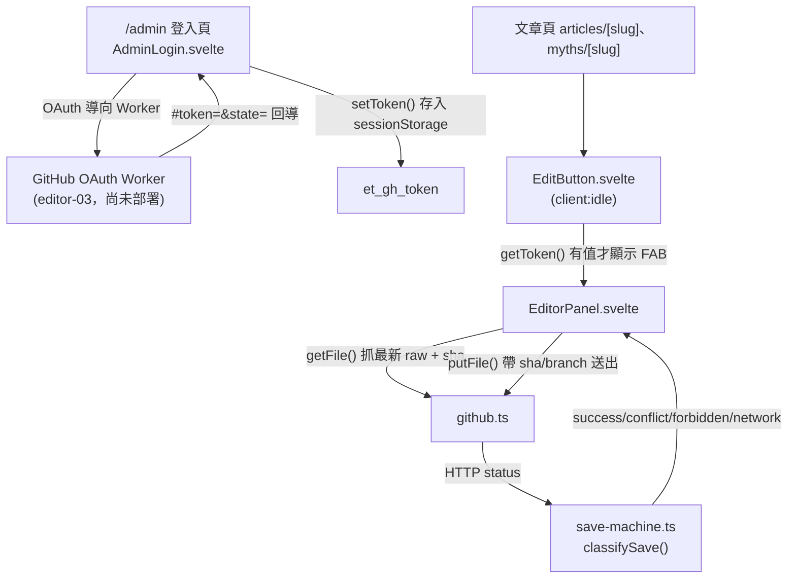

# Playbook：前台 MDX 編輯器 spine 核心

## 何時看這份

任務涉及以下任一情況：

- 修改 `/admin` 登入頁、`src/components/editor/AdminLogin.svelte`、新增文章 `NewArticle.svelte`
- 改編輯按鈕 `EditButton.svelte`、編輯面板 `EditorPanel.svelte`、SEO 欄位表單 `SeoFields.svelte`
- 改 SEO 欄位描述子 `src/utils/editor/seo-schema.ts`
- 改 GitHub commit client（`src/utils/editor/github.ts`）、存檔狀態機（`save-machine.ts`）、token 工具（`token.ts`）
- 把「編輯」按鈕掛到新的內容類型頁（articles / myths 之外）
- 調整 OAuth Worker 回導契約（`/admin#token=&state=`）

> 此編輯器是「裝飾層」：真正的寫入安全在 GitHub 端驗證（token 的 repo 寫入權）。前台的 `state` 僅作 CSRF 對照，非密鑰。

## 架構總覽

## 進入點

| 進入點 | 檔案 | 說明 |
|---|---|---|
| `/admin` | `src/pages/admin.astro` + `AdminLogin.svelte` | 隱藏管理登入頁。`noindex`，且已從 sitemap 排除（見下）。`client:only="svelte"`，因為元件讀 `sessionStorage`/`location`。 |
| 編輯按鈕 | `src/components/editor/EditButton.svelte` | `client:idle` island，`onMount` 偵測 `getToken()` 有值才顯示右下角 FAB。掛在 articles / myths 的 `[slug].astro`，於 `</Article>` 之前。**EditorPanel 為按鈕點擊時才 `await import()` 動態載入**（`let EditorPanel = $state(null)`，`openEditor()` 內首次點擊載入後直接以 `<EditorPanel .../>` 渲染）；故匿名訪客（無 token）永不下載 EditorPanel 那塊含 gray-matter/js-yaml 的 chunk（~113 KB）。dist 驗證：`EditButton.*.js` 對 EditorPanel 只有 `import("./EditorPanel.*.js")` 動態引用，無 static `from"…EditorPanel"`。 |
| 編輯面板 | `src/components/editor/EditorPanel.svelte` | 點 FAB 後開啟。**事實來源為 `{frontmatter, body}` 模型**（非 raw 字串）。載入時 `parse` 並記下 sha，存檔前 `serialize` 做 frontmatter 護欄。雙分頁見下節。 |
| SEO 欄位 | `src/components/editor/SeoFields.svelte` | 由 `getSeoFields(collection)` 驅動，**只列作者手寫的 `title` + `description`**（含字數提示）。社群分享標題/描述/分享圖都是 `social-meta.mjs` 的 `contentSocial()` 自動衍生（social 標題 fallback 到 title、social 描述 fallback 到 description、OG 圖是每個 collection 的固定靜態圖），**故不列入表單**——元件底部有一行說明告知使用者社群預覽自動產生。emit `onchange(newFrontmatter)` 回寫 `frontmatter`（其餘未列欄位如 tags/faq/references 由模型保留、存檔原樣帶回；要改用「原始碼」分頁）。 |
| 新增文章 | `src/components/editor/NewArticle.svelte` | 掛在 `/admin`。選 collection + 輸入 slug（驗證 `^[a-z0-9-]+$`）→ 建一個 `sha=null` 的 `initialDoc` → 開 EditorPanel 進入新增模式。`client:only="svelte"`。 |

## token 流程

1. `/admin` → 按「用 GitHub 登入」→ 產生 `state`（`Math.random`，僅 CSRF 對照）存進 `sessionStorage.et_oauth_state` → 導向 Worker `/auth?state=`。
2. Worker 完成 OAuth 後回導 `/admin#token=<gh_token>&state=<state>`。
3. `AdminLogin` 的 `onMount` 比對 fragment 的 `state` 與暫存的 `et_oauth_state`，相符才 `setToken()` 存入 `sessionStorage.et_gh_token`，並清掉 fragment。
4. 之後全站文章頁的 `EditButton` 偵測到 `et_gh_token` 即顯示「編輯」。
5. 登出 = `clearToken()` 移除 `et_gh_token`。

> token 存 `sessionStorage`（非 localStorage）：關閉分頁即失效，降低遺留風險。

## commit 流程（github.ts）

- `getFile(path, token)` → `GET /contents/<path>?ref=main`，回 `{ content (utf8 解碼), sha }`。
- `putFile({ path, content, sha, message, token })` → `PUT /contents/<path>`，body 帶 `branch: 'main'`、base64 編碼的 content，有 `sha` 才帶（更新既有檔）。回 HTTP status。
- base64 使用 UTF-8 安全的 `TextEncoder`/`btoa`、`atob`/`TextDecoder`，瀏覽器與 node 皆可（單元測試用 node）。

## 存檔狀態機（save-machine.ts）

`classifySave(status)` 四態，皆附可行動引導訊息：

| status | state | 引導 |
|---|---|---|
| 200 / 201 | `success` | 已存檔，部署中 |
| 409 | `conflict` | 提示按「重新載入最新版」重做，反覆衝突找網站工程師 |
| 403 | `forbidden` | 帳號無 repo 寫入權，確認管理者帳號或找工程師開通 |
| 其他 / fetch 失敗 | `network` | 連線異常，內容仍保留在頁面 |

**載入狀態**：開既有文章時 `status` 初始為 `loading`、只顯示「載入文章內容中…」；內容載好才 `loaded=true`。**lint 與 SEO 表單以 `loaded` 把關**——不可用 `status` 判斷（其 `error` 同時涵蓋載入失敗與存檔失敗），否則載入中會用空 frontmatter 跑 lint、誤跳「缺 description」。

存檔成功（`status === 'done'`）時，面板下方改顯示「完成」狀態（取代儲存/重新載入）：
- **部署輪詢**：存檔前先記 `preRunId`（`latestDeployRun()` 查 deploy.yml on main 的最新 run id 當基準），成功後 `startDeployPoll()` 每 15s 輪詢；出現 `id !== preRunId` 且 `completed` 的 run → `deployState` 設 `live`/`failed`。`deploy-status.ts` 查不到/無權限回 `null` → `preRunId` 為 null → 不輪詢、退回時間提示（graceful）。
- done 區塊依 `deployState` 顯示：pending「部署中…完成會自動顯示已上線」、live「✅ 已上線！重整文章頁即可看到」、failed「⚠ 部署失敗，查看進度/找工程師」、''（未輪詢）退回「約 1–2 分鐘後更新」。
- 按鈕「關閉」（`onclose`）、「繼續編輯」（`stopDeployPoll()` + 重設）。`onDestroy(stopDeployPoll)` 防 timer 洩漏。

## SEO 欄位 / 原始碼雙分頁（單一事實來源）

EditorPanel 持有 `frontmatter` + `body` 兩個 `$state`，**兩個分頁編輯的是同一個模型**，不會分歧：

- **「SEO 欄位」分頁**：渲染 `SeoFields`（綁 `frontmatter`）＋ 正文 `<textarea>`（`bind:value={body}`）。SeoFields 的 `onchange` 以不可變更新（`{ ...frontmatter, [key]: value }`）回寫 `frontmatter`。
- **「原始碼」分頁**：進入時 `enterSource()` 把當前模型 `serialize` 成 `rawDraft` 字串。三條離開路徑全部走共用的 `commitSourceDraft(): boolean`（唯一真相來源，`parse` 回 `frontmatter`/`body`，成功回 `true` 並清訊息、失敗回 `false` 並設錯誤訊息且不覆寫模型）：
  - 「套用原始碼」`applySource()`：commit 成功才切回 SEO 分頁。
  - 「SEO 欄位」分頁鈕 `goSeoTab()`：在原始碼分頁時先 commit，成功才切頁；失敗留在原始碼分頁顯示錯誤（不默默丟棄編輯）。
  - 「儲存」`save()`：若當前在原始碼分頁，先 `commitSourceDraft()`；解析失敗則 `status='error'` 並中止存檔（不 `putFile`、不推 GitHub）。
- 存檔一律在模型反映最新草稿後 `serialize({ frontmatter, body })` 再送 `putFile`，兩分頁殊途同歸。
- **不變式**：原始碼分頁的編輯不存在被默默丟棄的路徑——不是被套用進模型，就是以解析錯誤擋下並留在原始碼分頁。

> SEO 欄位由 `src/utils/editor/seo-schema.ts` 的 `getSeoFields(collection)` 驅動。**原則：只放作者真正手寫、且該 collection schema 真有的欄位**（目前 = `title` + `description`）。
> 自動衍生的欄位（社群標題/描述、OG 圖——見 `contentSocial()`）**不要放進表單**，那是誤導；尤其 `ogTitle`/`ogImage` 對 articles 根本不存在，硬填存檔會讓 Astro schema 驗證失敗、build 崩（2026-06-08 兩次踩到：先誤把 og 套到 articles，再誤把可自動衍生的 social 欄位也擺出來）。要加欄位前先確認「這是作者手寫的嗎？」與 `content.config.ts`。

## 新增文章流程（sha=null 建檔）

1. `/admin` 登入後，`NewArticle` 顯示 collection 下拉 + slug 輸入。
2. 按「建立並編輯」→ slug 驗 `^[a-z0-9-]+$`（不符 `alert`）→ 組 `repoPath = src/content/<collection>/<slug>.mdx`、`initialDoc = { frontmatter: { title, description, publishDate }, body }`。
3. 以 `initialDoc` 開 EditorPanel。`initialDoc` 非空時面板進入新增模式：`sha=null`、跳過 `getFile`、`status='ready'`。
4. 存檔走 `putFile`（**不帶 sha → GitHub 建立新檔**），commit message 為 `content: 前台新增 <slug>`。
5. slug 撞既有檔：因新增模式無 sha，GitHub 回 422/409 → 由 `classifySave` 顯示衝突引導。

> 編輯既有文章與新增共用同一個 `EditorPanel`。差別只在有無 `initialDoc`：有則新增（sha=null），無則 `getFile` 載入既有（記 sha）。EditButton 不傳 `initialDoc`，行為與重構前一致。

## 鎖定參數（動之前必看）

- repo 常數寫死在 `github.ts`：`OWNER = 'weiqi-kids'`、`REPO = 'evidencetoday.news'`、`branch: 'main'`。換 repo 要改這裡。
- `WORKER` 網域在 `AdminLogin.svelte` 是 placeholder（`<account>`），Worker 部署後填實際值。**不影響 build 編譯**。
- `/admin` 排除 sitemap：在 `astro.config.mjs` 用 `sitemap({ filter: (page) => !page.includes('/admin') })`。新增其他隱藏頁要一併加進 filter。
- 掛 EditButton 的 `repoPath` = `src/content/<collection>/${entry.id}`（`entry.id` 已含副檔名）；`slug` = 去副檔名。新增內容類型時照此模式。

## 測試

純邏輯三檔走 TDD，單元測試在同目錄：

- `pnpm test src/utils/editor/github.test.ts`
- `pnpm test src/utils/editor/save-machine.test.ts`
- `pnpm test src/utils/editor/token.test.ts`

UI（Svelte island / Astro 頁）以 `pnpm build` 驗證可編譯；端到端 OAuth 需 Worker 部署後才能跑通。

## 測試（forms / seo-schema）

- `pnpm test src/utils/editor/seo-schema.test.ts` — `getSeoFields` 的 per-collection 與 fallback 行為。
- SeoFields / NewArticle / 重構後的 EditorPanel 為 Svelte island，以 `pnpm build` 驗證可編譯。

## 範圍邊界

- EditorPanel 已從 raw 字串重構為 `{frontmatter, body}` 模型 + 「SEO 欄位 / 原始碼」雙分頁（`editor-04b`）。新增文章流程同 plan 接入。
- lint 側欄、SSR 真實預覽由 `editor-02-lint-engine` 與 SSR 預覽計畫接入，面板已預留 `parse`/`serialize` 接點。

## AI 建議（editor-06）

> **目前以 feature flag 隱藏**：`EditorPanel.svelte` 的 `const AI_ENABLED = false`，AI 按鈕區塊以 `{#if AI_ENABLED}` 包住，故前台不顯示。等 AI Worker 部署（`workers/ai-suggest/` + `wrangler secret put ANTHROPIC_API_KEY`）後把 `AI_ENABLED` 改 `true` 即開啟。`suggest`/`acceptSuggestion`/`AI_WORKER` 程式碼保留待用。

- EditorPanel 的 SEO 分頁底下有「AI 潤飾正文 / AI 摘要」按鈕，呼叫 `suggest(task)`：以 `getToken()` 的 GitHub token 帶 `Authorization: Bearer`，POST 到 `${AI_WORKER}/suggest`，body 為 `{ task, context:{title}, selection: body }`，成功回 `{ suggestion }` 顯示於 `<pre>`，按「採用為正文」覆寫 `body`。
  - 未登入（`getToken()` 為 null）時 `suggest` 直接顯示「請先登入管理者帳號再使用 AI 建議。」並中止，不送出 `Authorization: Bearer null` 的請求。
  - 「採用為正文」（`acceptSuggestion`）會先 `confirm` 再覆寫，避免覆蓋掉產生建議後又手動編輯的正文。
- `AI_WORKER` 網域在 `EditorPanel.svelte` 已填實際值（見下方「部署網域」）。**不影響 build 編譯**（fetch 僅在瀏覽器 handler 執行）。
- Worker 後端在 `workers/ai-suggest/`：先用呼叫者 token 驗 repo push 權（無權回 403）才呼叫付費的 Anthropic API，避免端點被濫用。部署與密鑰設定見 `workers/ai-suggest/README.md`。
- 模型由 `wrangler.toml` 的 `ANTHROPIC_MODEL`（預設 `claude-haiku-4-5-20251001`）決定。

## 正文 WYSIWYG（editor-07）

EditorPanel 的 SEO 主分頁正文不再是純 textarea，改用 `BodyEditor.svelte` 包裝 [`@toast-ui/editor`](https://github.com/nhn/tui.editor) 的所見即所得（WYSIWYG）模式。原始碼分頁仍是 raw markdown textarea，兩條路徑共用同一個 `{frontmatter, body}` 模型。

- **元件**：`src/components/editor/BodyEditor.svelte`，props 為 `{ value, slug, onchange }`。
  - `initialEditType: 'wysiwyg'` + `hideModeSwitch: true`：固定 WYSIWYG，不顯示「markdown / wysiwyg」切換鈕（站上的 markdown 編輯由原始碼分頁負責）。
  - `toolbarItems`：H2/H3（heading）、bold、italic、link、ul、ol、quote、image。刻意精簡，不放表格／程式碼區塊等較少用且易產生雜訊 markdown 的工具。
  - `usageStatistics: false`：關閉 Toast UI 的匿名使用統計回傳。
- **body ↔ 模型同步（雙向，含防迴圈護欄）**：
  - 編輯器內容變動 → `change` 事件 → `editor.getMarkdown()` → `onchange(md)` → EditorPanel 回寫 `body = md`。
  - 外部改 `body`（例：原始碼分頁套用、reload 重新載入、AI 採用為正文）→ `$effect` 偵測 `value !== lastSet` → `editor.setMarkdown(value)`。
  - `lastSet` guard：`change` 與 `$effect` 兩端都會先更新 `lastSet`，避免「外部更新觸發 setMarkdown → 觸發 change → 又回寫 → 再觸發 $effect」的無限迴圈。
- **圖片上傳**（`addImageBlobHook`）：在編輯器貼上／選檔插入圖片時觸發 → `uploadImage({ blob, slug, token: getToken(), timestamp })`（`src/utils/editor/image-upload.ts`）→ 以 GitHub Contents API 將檔案 commit 進 `public/images/<slug>-<timestamp>.<ext>` → 回傳**絕對路徑** `/images/<name>` 並 `callback(url, '')` 插入文章。
  - 路徑一律絕對（`/images/...`），**不用相對路徑**，文章搬移分類不會壞圖。
  - 圖片是另一筆 commit 進 repo，**要等下一次部署完成才看得到實際圖檔**（編輯當下預覽會是尚未部署的 raw 路徑）。上傳失敗（未登入／無寫入權）以 `alert` 提示。
- **匿名訪客零載入 Toast UI（JS + CSS，load-bearing）**：
  - **JS**：BodyEditor 在 `onMount` 內 `await import('@toast-ui/editor')`（動態），只在編輯器開啟時抓。
  - **CSS**：⚠️ 不能用 `import '...toastui-editor.css'`——即使動態 import，Astro 仍會把它收進文章頁 render-blocking 的 route CSS（與 EditButton 的 `.et-edit-fab` 綁在一起，~170KB 害每個匿名訪客白下載）。**正解**：把 CSS 複製到 `public/vendor/toastui-editor.css`（脫離 module graph），BodyEditor 在 `onMount` 以 `ensureToastCss()` runtime 注入 `<link href="/vendor/toastui-editor.css">`。驗證：build 後 `dist/articles/*/index.html` link 的 route CSS 不含 `toastui-editor`、`dist/_astro/*.css` 無任何 toast chunk。
  - **升級 Toast UI 時**：須同步重新複製 `node_modules/@toast-ui/editor/dist/toastui-editor.css` → `public/vendor/toastui-editor.css`。
- **首次 WYSIWYG 編輯會把 markdown 正規化（canonicalize）**：Toast UI 解析後重新序列化 markdown，可能調整空白、清單符號、強調語法等寫法。第一次儲存會看到一次「格式整理」的 diff，**實際內容不變**；之後再編輯就穩定了。

## 部署網域（workers.dev 子網域：`lightman-chang`）

- OAuth Worker：`https://evidencetoday-github-oauth.lightman-chang.workers.dev`（`AdminLogin.svelte` 的 `WORKER`）
  - GitHub OAuth App callback URL 須設為上述 `+ /callback`
- AI Worker：`https://evidencetoday-ai-suggest.lightman-chang.workers.dev`（`EditorPanel.svelte` 的 `AI_WORKER`）
- 兩者皆需 `wrangler deploy` 後才生效；secret 分別為 `GITHUB_CLIENT_SECRET`、`ANTHROPIC_API_KEY`。`GITHUB_CLIENT_ID` 填於 `workers/github-oauth/wrangler.toml`。

## 樣式規範（editor UI 必須遵守站上 CSS 規範）

編輯器元件的 `<style>` **一律用設計 token，禁止寫死 hex/rgba/字級**（同 README「CSS / RWD 通用規範」與 `src/styles/tokens.css`）：

- 顏色：`var(--color-teal|coral|ink|fog|paper|verdict-*)` 與 `color-mix(in oklch, …)`；`white` 可直接用（同站上慣例），但**禁 `#fff`/hex fallback**。
- 字級：`var(--text-body|meta|caption|badge|h3)`（`src/styles/typography.css`），禁寫死 rem。
- 圓角：`var(--radius-pill|card|sm)`；按鈕比照 `Button.astro`（`min-height:44px`、`--radius-pill`、`--font-ui`、`--text-meta`、`font-weight:600`、`:focus-visible` outline）。
- 間距用 `clamp()` fluid（禁寫死 px + media query 覆蓋）。
- 樣式留在各元件 scoped `<style>`，**不抽全域 CSS**（避免匿名訪客也載入，破壞 EditButton→EditorPanel 的 lazy-load）。

## /admin 操作引導與新增文章

- `/admin`（`src/pages/admin.astro`）除登入外，提供：(1)「怎麼編輯文章？」三步說明（**強調 token 是 sessionStorage、僅限同分頁**，編輯鈕在文章頁右下角）；(2) 由 `getCollection` 取得的真實文章快速連結（同分頁前往）。
- 編輯按鈕 FAB **只在 articles/myths 內頁右下角**出現，不在 `/admin`。
- 新增文章（`NewArticle.svelte`）為**標題優先**：分類下拉（中文標籤）→ 標題 → slug（附說明：成為網址、僅小寫英數連字號）。slug 與標題皆驗證後才建立。
