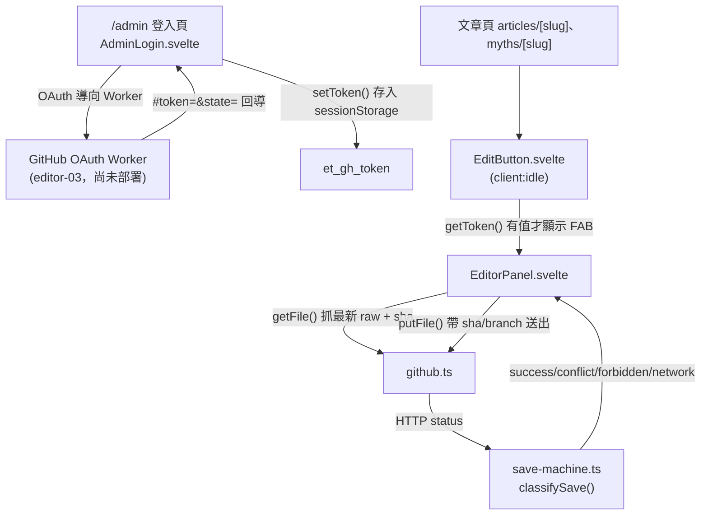

# Playbook：前台 MDX 編輯器 spine 核心

## 何時看這份

任務涉及以下任一情況：

- 修改 `/admin` 登入頁、`src/components/editor/AdminLogin.svelte`
- 改編輯按鈕 `EditButton.svelte`、編輯面板 `EditorPanel.svelte`
- 改 GitHub commit client（`src/utils/editor/github.ts`）、存檔狀態機（`save-machine.ts`）、token 工具（`token.ts`）
- 把「編輯」按鈕掛到新的內容類型頁（articles / myths 之外）
- 調整 OAuth Worker 回導契約（`/admin#token=&state=`）

> 此編輯器是「裝飾層」：真正的寫入安全在 GitHub 端驗證（token 的 repo 寫入權）。前台的 `state` 僅作 CSRF 對照，非密鑰。

## 架構總覽

## 進入點

| 進入點 | 檔案 | 說明 |
|---|---|---|
| `/admin` | `src/pages/admin.astro` + `AdminLogin.svelte` | 隱藏管理登入頁。`noindex`，且已從 sitemap 排除（見下）。`client:only="svelte"`，因為元件讀 `sessionStorage`/`location`。 |
| 編輯按鈕 | `src/components/editor/EditButton.svelte` | `client:idle` island，`onMount` 偵測 `getToken()` 有值才顯示右下角 FAB。掛在 articles / myths 的 `[slug].astro`，於 `</Article>` 之前。 |
| 編輯面板 | `src/components/editor/EditorPanel.svelte` | 點 FAB 後開啟。raw `<textarea>` 為單一事實來源。載入時抓最新 sha，存檔前做 frontmatter 護欄（`parse`+`serialize` 能通過才送出）。 |

## token 流程

1. `/admin` → 按「用 GitHub 登入」→ 產生 `state`（`Math.random`，僅 CSRF 對照）存進 `sessionStorage.et_oauth_state` → 導向 Worker `/auth?state=`。
2. Worker 完成 OAuth 後回導 `/admin#token=<gh_token>&state=<state>`。
3. `AdminLogin` 的 `onMount` 比對 fragment 的 `state` 與暫存的 `et_oauth_state`，相符才 `setToken()` 存入 `sessionStorage.et_gh_token`，並清掉 fragment。
4. 之後全站文章頁的 `EditButton` 偵測到 `et_gh_token` 即顯示「編輯」。
5. 登出 = `clearToken()` 移除 `et_gh_token`。

> token 存 `sessionStorage`（非 localStorage）：關閉分頁即失效，降低遺留風險。

## commit 流程（github.ts）

- `getFile(path, token)` → `GET /contents/<path>?ref=main`，回 `{ content (utf8 解碼), sha }`。
- `putFile({ path, content, sha, message, token })` → `PUT /contents/<path>`，body 帶 `branch: 'main'`、base64 編碼的 content，有 `sha` 才帶（更新既有檔）。回 HTTP status。
- base64 使用 UTF-8 安全的 `TextEncoder`/`btoa`、`atob`/`TextDecoder`，瀏覽器與 node 皆可（單元測試用 node）。

## 存檔狀態機（save-machine.ts）

`classifySave(status)` 四態，皆附可行動引導訊息：

| status | state | 引導 |
|---|---|---|
| 200 / 201 | `success` | 已存檔，部署中 |
| 409 | `conflict` | 提示按「重新載入最新版」重做，反覆衝突找網站工程師 |
| 403 | `forbidden` | 帳號無 repo 寫入權，確認管理者帳號或找工程師開通 |
| 其他 / fetch 失敗 | `network` | 連線異常，內容仍保留在頁面 |

## 鎖定參數（動之前必看）

- repo 常數寫死在 `github.ts`：`OWNER = 'weiqi-kids'`、`REPO = 'evidencetoday.news'`、`branch: 'main'`。換 repo 要改這裡。
- `WORKER` 網域在 `AdminLogin.svelte` 是 placeholder（`<account>`），Worker 部署後填實際值。**不影響 build 編譯**。
- `/admin` 排除 sitemap：在 `astro.config.mjs` 用 `sitemap({ filter: (page) => !page.includes('/admin') })`。新增其他隱藏頁要一併加進 filter。
- 掛 EditButton 的 `repoPath` = `src/content/<collection>/${entry.id}`（`entry.id` 已含副檔名）；`slug` = 去副檔名。新增內容類型時照此模式。

## 測試

純邏輯三檔走 TDD，單元測試在同目錄：

- `pnpm test src/utils/editor/github.test.ts`
- `pnpm test src/utils/editor/save-machine.test.ts`
- `pnpm test src/utils/editor/token.test.ts`

UI（Svelte island / Astro 頁）以 `pnpm build` 驗證可編譯；端到端 OAuth 需 Worker 部署後才能跑通。

## 範圍邊界

- 此 spine 的 EditorPanel 是 **raw `<textarea>`** 版（source of truth = raw 字串）。frontmatter/body 模型 + SEO 分頁由後續 `editor-04b` 計畫接入，勿在此提前實作。
- lint 側欄、SSR 真實預覽由 `editor-02-lint-engine` 與 SSR 預覽計畫接入，面板已預留 `raw`/`parse(raw)` 接點。
