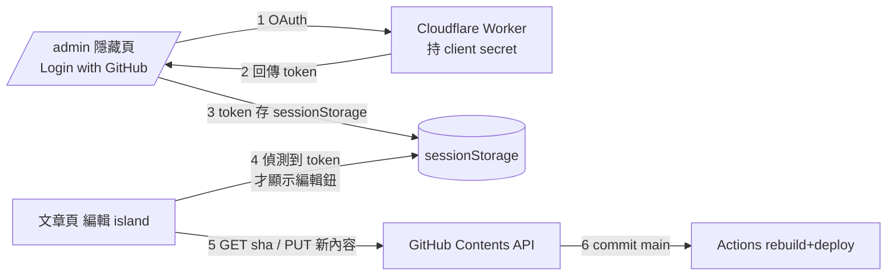

# 前台 MDX 編輯器設計

- 日期：2026-06-08
- 狀態：設計定案，待實作
- 適用：evidencetoday.news（Astro 5 + GitHub Pages 純靜態）

## 目標

讓管理者在已部署的前台頁面上，直接編輯 Markdown/MDX 文章的整檔原始內容，存檔後 commit 回 `main`，由既有 deploy workflow 自動重建上線。

## 核心安全觀念

「偵測瀏覽者是否為管理者」拆成兩層，**真正的安全邊界在第二層**：

1. **裝飾層（前端，可偽造）**：登入後把 GitHub OAuth token 存進瀏覽器 `sessionStorage`。頁面載入時偵測到此值存在 → 顯示「編輯」按鈕；不存在 → 完全不顯示。此層只控制 UI 可見性，刻意不做防竄改。
2. **真實層（GitHub 伺服器端強制）**：存檔走 GitHub Contents API，GitHub 驗證該 token 對 repo 是否有寫入權。無寫入權的 token（即使有人用 DevTools 叫出編輯 UI）commit 一律被回 403。

因此：非管理者即使登入、即使看到編輯按鈕，也無法寫入 → 無實質風險。

## 架構

## 元件

### 1. `/admin` 隱藏登入頁（Astro static page）

- 路徑 `src/pages/admin.astro`，不在任何導覽列／sitemap 公開連結。
- 內容：「用 GitHub 登入」按鈕、登入狀態顯示、「登出」按鈕（清除 token）。
- 登入流程：按鈕導去 Worker `/auth` → GitHub 授權頁 → Worker `/callback` 換得 token → 寫進 `sessionStorage`（key：`et_gh_token`）→ 顯示「已登入為 <login>」。
- 登出：移除 `sessionStorage` 的 `et_gh_token`。

### 2. Cloudflare Worker（OAuth proxy）

- 約 40 行，獨立部署（wrangler）。
- 端點：
  - `GET /auth`：302 轉址到 `https://github.com/login/oauth/authorize`，帶 `client_id`、`scope`、`redirect_uri`、`state`。
  - `GET /callback`：收 `code`，以 `code` + `client_secret` POST `https://github.com/login/oauth/access_token` 換 token，回傳給前台（透過 redirect 帶片段或 postMessage）。
- `client_secret` 放 Worker secret（`wrangler secret put`），前端永不接觸。
- CORS / redirect_uri 僅允許 `https://evidencetoday.news`。
- OAuth scope：僅取得能對本 repo `contents` 寫入的最小權限。

### 3. 編輯 island（Svelte，掛在內容頁）

- 掛載於 articles / myths / ingredients（及其他內容集合）的 `[slug]` 頁面。
- 掛載時讀 `sessionStorage.et_gh_token`：
  - 有 → 顯示「編輯」按鈕。
  - 無 → 不 render 任何東西（一般訪客零影響、零額外請求）。
- 按「編輯」：
  1. 用 Contents API `GET /repos/weiqi-kids/evidencetoday.news/contents/<path>` 抓**當前最新**檔案內容與 `sha`（不使用 build 當下的舊內容，避免覆蓋他人變更）。
  2. 把 raw MDX 放進全螢幕 `<textarea>` 編輯器。
- build 時把該頁對應的 repo 檔案路徑（如 `src/content/myths/xxx.mdx`）寫進 island props，前端據此決定編輯目標。

## 存檔流程

- `PUT /repos/weiqi-kids/evidencetoday.news/contents/<path>`，body：`message`、`content`（base64）、`sha`、`branch: main`。
- commit 訊息：`content: 透過前台編輯 <slug>`。
- 成功後提示「已存檔，部署中」。

## 防呆與衝突處理

- **409 衝突（重要）**：站上有「日期自然化」CI 與新聞自動化管線會 commit。若 `sha` 過期，GitHub 回 409 → 編輯器顯示「檔案已被更新，請重新載入後再編輯」，**不硬蓋**。
- **frontmatter 護欄**：存檔前對 frontmatter 做輕量 YAML parse；解析失敗就擋下、不 commit。降低把 `main` 改壞、部署 failure 的機率（參考 2026-06-08 幽靈圖事件）。

## 範圍（YAGNI）

- **做**：整檔 raw MDX 編輯、單檔存檔、最新 sha 抓取、409 衝突偵測、frontmatter parse 護欄、`/admin` 登入/登出。
- **不做**（日後另議）：新增/刪除檔案、圖片上傳、多檔批次編輯、即時預覽/所見即所得、欄位表單式編輯、PR/審核流程。

## 安全註記

- token 存 `sessionStorage`：關閉分頁即失效，暴露窗口最短；理論上公開站若有 XSS 仍可能在分頁存活期間被竊，緩解靠最小 scope + 可隨時於 GitHub 撤銷。
- Worker 為唯一持有 client secret 之處；前端與 repo 皆不含 secret。

## 待實作時決定的細節

- token 回傳前台的具體機制（redirect fragment vs popup + postMessage）。
- 編輯 island 要先上哪幾個內容集合（建議先 articles + myths）。
- Worker 部署網域與 `/admin` redirect_uri 的實際值。
