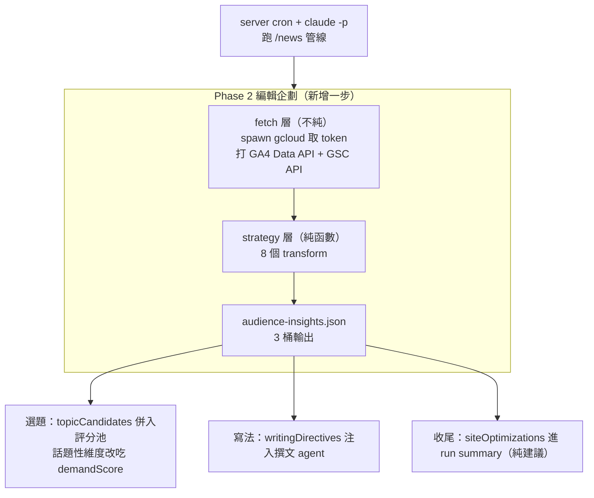

# Audience Insights — 用 GA4／GSC 數據驅動 /news 選題與寫法

> 目標：讓 **server cron + `claude -p`** 跑的 `/news/` 趨勢新聞管線，在寫稿前讀取本站真實的「搜尋需求 + 閱讀表現 + AI 轉介」數據，據以**選題**與**指導寫法**，提高本站被各家 LLM 引用／推薦的機會。
>
> 定位：本案是 GEO 策略地圖（`docs/superpowers/specs/2026-06-14-geo-strategy-design.md`）**D 區「成效監測」的閉環操作化**——把監測訊號從「事後看」變成「主動驅動選題與寫作」，同時餵養 B 區「內容答案化」。

---

## 1. 背景與前置

- **前置已完成（2026-06-16）**：修復 Analytics 全站追蹤靜默 bug（`bootstrapAnalytics()`，commit `1875728`）。GA4 富閱讀事件與 `sessionSource`（含 AI 助理來源）自此才真正開始累積。GSC 服務帳號權限亦於同日確認生效、已有真實搜尋資料。
- **既有報表工具**：`~/ga4-report.py`（本機）已能同時讀 GA4 Data API + GSC API，是本案 fetch 層的參考實作。
- **既有管線**：`/news/` 管線見 `docs/news_sop.md`，五維度評分（證據30／影響25／新穎20／實用15／**話題性10**）→ 撰文 → 審核 → 發布。

### 1.1 關鍵環境前提（修正既有文件的錯誤）

- 管線實際執行環境為 **使用者 server 上的 `cron + claude -p`**，該環境**具備 gcloud 服務帳號認證與對外網路**，流程與開發機相同。
- 因此可在**寫稿時即時呼叫 GA4／GSC API**，無需「預先抓取並 commit 檔案」的繞路，亦無需 GitHub Action／secret。
- ⚠️ `docs/news_sop.md` 第一節現述為「Claude Code 雲端排程 / Trigger ID / claude.ai 管理介面」，**與實際不符、屬過時內容**，本案須一併修正為 server cron + `claude -p`。

### 1.2 現實限制

- **數據稀疏**：站點剛上線，GA4 富事件與 GSC 曝光都還很少。本案 v1 的價值是**先把管路接好**，隨數據累積自動增強。設計必須**資料空時優雅退化＝現狀**。

---

## 2. 架構



**精神**：Phase 2 多一步——跑 `scripts/audience-insights.mjs`，它即時抓 GA4＋GSC、跑完 8 策略、吐出結構化 JSON；管線拿去（a）選題、（b）指導寫法、（c）產出既有頁補強建議清單。

---

## 3. 程式切分（design for isolation）

`scripts/audience-insights.mjs`，兩層責任分離：

| 層 | 純度 | 職責 | 可測性 |
|---|---|---|---|
| **fetch 層** | 不純（I/O）| `spawn('gcloud', …)` 取 token；打 GA4 `runReport` + GSC `searchAnalytics/query`；回傳原始列 | 薄層，手動整合驗證 |
| **strategy 層** | 純函數 | 8 個 `(rawRows, config) → 部分桶輸出` transform，無 I/O | **vitest 單元測試**（比照 `src/utils/analytics.test.ts`）|
| **組裝層** | 不純 | 合併 8 策略輸出 → 寫 `data/audience-insights.json` + stdout | 整合驗證 |

常數（與 `~/ga4-report.py` 對齊）：
- GA4 `PROPERTY = properties/541692554`（`G-5JH83LM8X7`）
- GSC `sc-domain:evidencetoday.news`
- SA `ga4-insights@yaocare.iam.gserviceaccount.com`，scope `analytics.readonly` + `webmasters.readonly`

> 純函數策略層獨立於 fetch，意味著：給定一組假的 GA4/GSC 列，每個策略的輸出完全可預測、可測；fetch 失敗或回空時，策略層收到空列、回空桶。

---

## 4. 輸出 schema（`data/audience-insights.json`）

```jsonc
{
  "generatedAt": "2026-06-16T12:00:00+08:00",   // 台灣時間 (UTC+8)
  "window": { "ga4Days": 28, "gscDays": 28 },
  "dataHealth": { "ga4Events": 0, "gscRows": 3, "sparse": true },

  "topicCandidates": [
    {
      "topic": "褪黑激素 帶回台灣 法規界線",
      "source": "search-gap",                 // 產生此候選的策略 id
      "rationale": "GSC 曝光 4、平均排名 10.75、站內無對應文章",
      "demandScore": 7.2,                      // 0–10，餵入評分的話題性維度
      "suggestedAngle": "入境攜帶處方藥的合法性與劑量界線",
      "evidence": { "impressions": 4, "position": 10.75, "aiReferrals": 0, "onSiteSearch": 0 }
    }
  ],

  "writingDirectives": [
    {
      "directive": "成分解析類讀完率最高（62%）、平均 ~1400 字、FAQ 展開率高 → 維持問答結構 + ≥5 條可驗證來源",
      "basis": "completion+aeo",
      "confidence": "low"                      // low|med|high，依樣本量
    }
  ],

  "siteOptimizations": [
    {
      "type": "edit-existing",
      "target": "/articles/<slug>/",
      "action": "標題重寫 | 補 FAQ 條目",
      "rationale": "GSC 排名 8、CTR 0.5%、含疑問句查詢未被回答"
    }
  ]
}
```

三桶去向：
- `topicCandidates` → Phase 2 評分池（選題）
- `writingDirectives` → Phase 3 撰文 prompt（寫法）
- `siteOptimizations` → run summary（**v1 純建議，不自動編輯既有文章**）

---

## 5. 八個策略定義

| id | 策略 | 輸入（GA4/GSC）| 輸出桶 | 核心邏輯（門檻見 config）|
|---|---|---|---|---|
| `llm-referral` | LLM 轉介逆向工程 | GA4 `sessionSource` 命中 AI 助理網域 × content_slug | topicCandidates(+directive) | 被 AI 引用帶流量的文章 → 產同類延伸主題；`aiReferrals` 計入 evidence |
| `search-gap` | 搜尋需求缺口 | GSC query：高曝光且（站內無對應頁 或 排名>10）| topicCandidates | 曝光≥N 且 position>10 或無對應 slug → 候選 |
| `trend-radar` | 時效熱點雷達 | GSC 近 7 天 vs 前期曝光暴增 | topicCandidates | 暴增倍率≥R → 候選並標記高優先（editorPick 提示）|
| `onsite-search` | 站內搜尋未滿足 | GA4 `view_search_results` searchTerm | topicCandidates | 站內被搜但站內無對應內容 → 高意圖候選 |
| `completion-style` | 讀完率回饋寫法 | GA4 `read_complete` ÷ `content_view`（依 content_type/category）| writingDirectives | 讀完率最高的類型/長度 → 風格指令 |
| `aeo-structure` | AEO 結構訊號 | GA4 `faq_open` / `references_expand` / `reached_references` | writingDirectives | 高互動結構元素 → 強化 FAQ + 可驗證來源指令 |
| `question-faq` | 問句查詢→FAQ | GSC query 中疑問句（為什麼/會不會/能不能/safe?…）| topicCandidates + siteOptimizations | 有對應頁→建議補 FAQ；無→新主題候選 |
| `rank-boost` | 臨門一腳補強既有頁 | GSC 既有頁 position 5–15 且有曝光 | siteOptimizations | 第一頁邊緣既有頁 → 補強建議（標題/FAQ）|

每個策略皆為純函數，無命中時回空陣列。

---

## 6. 管線消費（修改 SOP/AGENTS 指令層，不改沙箱）

**Phase 2 編輯企劃**
1. 照現狀用 WebSearch 建素材池。
2. **新增**：執行 `node scripts/audience-insights.mjs`，讀 `topicCandidates`。
3. 將 `topicCandidates` 併入素材池，標記來源 `internal-demand`。
4. 五維度評分時，**話題性維度改用候選的 `demandScore`**（真實搜尋需求/AI 轉介，取代 LLM 主觀猜測）；其餘四維度照舊由編輯 agent 判定。

**Phase 3 平行撰文**
- 每個撰文 agent 的 prompt 注入該批 `writingDirectives`（「本站讀者數據顯示的有效寫法 / LLM 友善結構」）。

**收尾**
- `siteOptimizations` 寫入 run summary（與 PR/草稿並列），供使用者人工決定。

---

## 7. Config

`data/news-automation-config.json` 新增 `audienceInsights` 區塊（集中可調參數）：

```jsonc
"audienceInsights": {
  "enabled": true,
  "windowDays": 28,
  "trendWindowDays": 7,
  "thresholds": {
    "minImpressions": 1,
    "lowRankPosition": 10,
    "boostRankRange": [5, 15],
    "trendSurgeRatio": 2.0
  },
  "demandScoreToTopicalityWeight": 1.0,
  "aiReferralDomains": ["chat.openai.com", "chatgpt.com", "perplexity.ai", "gemini.google.com", "claude.ai", "copilot.microsoft.com"]
}
```

`enabled:false` 或腳本失敗 → 管線退回現狀（不阻斷發布）。

---

## 8. 優雅退化與錯誤處理

- **資料空**：各策略回空桶 → 評分池無新增、無寫法指令、無建議清單 → 管線行為＝現狀。
- **fetch 失敗**（gcloud token 取不到、API 4xx/5xx）：腳本印警告、輸出空桶 JSON、**exit 0**，管線繼續（追蹤數據不該擋發稿）。
- **時區**：`generatedAt` 一律台灣時間（UTC+8）。

---

## 9. 測試

- **strategy 層**：8 個純函數各自單元測試（vitest），餵假 GA4/GSC 列，驗證命中/空資料/門檻邊界。
- **schema**：輸出物件以最小驗證（必要鍵存在、型別正確）。
- **fetch 層**：薄層，手動整合驗證（本機 gcloud 實打一次）；不進 CI（CI 無認證）。

---

## 10. 文件同步（硬規則 1）

- `docs/news_sop.md` — 加 Phase 2 insights 步驟；**修正第一節**過時的雲端排程敘述 → server cron + `claude -p`。
- `docs/playbooks/audience-insights.md` — 新增 playbook（鎖定參數／修改流程／常見陷阱／驗證清單）。
- `AGENTS.md`「撰寫趨勢文章」、`README.md` 任務索引、`docs/architecture.md`（GEO/Analytics 區）、`docs/playbooks/news-article.md` 對應更新。

---

## 11. 非目標（YAGNI，明確排除）

- ❌ **自動編輯既有已發布文章**（`siteOptimizations` v1 僅產出建議清單）。
- ❌ GitHub Action／secret／預先 commit insights 檔（server 可即時抓，不需要）。
- ❌ 跨 LLM 抓取偏好差異化、Cloudflare 爬蟲 log 等進階監測（屬 GEO 地圖後續 phase）。
- ❌ 變更現有五維度中話題性以外的維度權重。

---

## 12. 交付物清單（→ writing-plans 實作範圍）

1. `scripts/audience-insights.mjs`（fetch 層 + 組裝層）
2. `scripts/lib/insight-strategies.mjs`（8 個純函數策略）+ 對應 vitest 測試
3. `data/news-automation-config.json` 加 `audienceInsights` 區塊
4. SOP/AGENTS/README/playbook/architecture 文件同步（含修正 news_sop 第一節）
5. 一份 `data/audience-insights.json` 範例（首次本機實跑產出，供 review）
